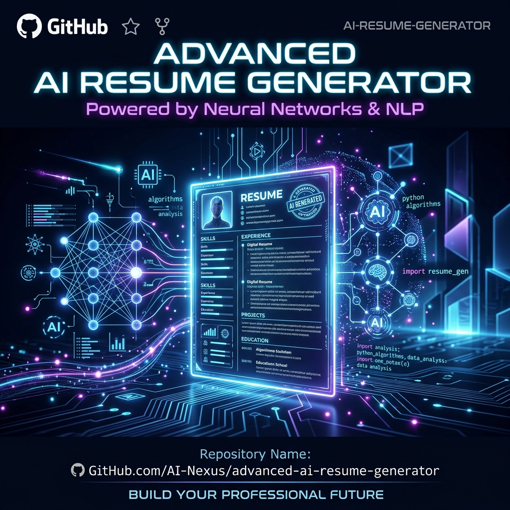
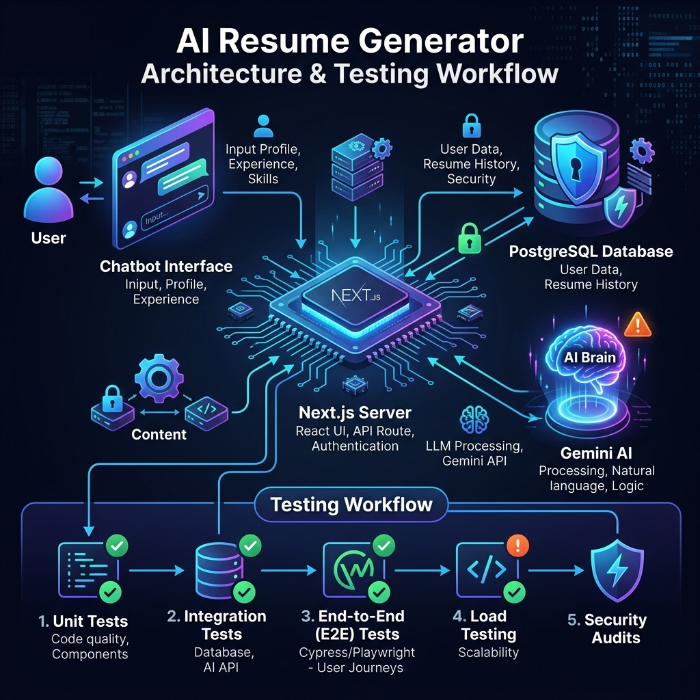

<div align="center">
  

  <br />
  <br />

  
  
  
  
  
  

  <p align="center">
    <strong>An incredibly powerful, state-of-the-art web application that leverages conversational AI to help you build ATS-Compliant, visually stunning resumes in minutes.</strong>
  </p>
</div>

---

## ✨ Features

| 🚀 Feature | 📝 Description |
| :--- | :--- |
| **🧠 AI Career Coach** | An interactive chatbot powered by Gemini 2.5 Flash that asks targeted questions to dynamically extract your professional qualities. |
| **⚡ Real-Time ATS Feedback** | As you edit your resume, the AI silently analyzes it in the background to suggest keyword and formatting improvements instantly. |
| **🎛️ Hybrid Input System** | Seamlessly switch between chatting with the AI and manually filling out your details in a traditional, highly-reactive form. |
| **🎨 Glassmorphism UI** | A highly aesthetic, light, and vibrant interface featuring real-time preview of your generated resume. |
| **🖨️ True Vector PDF Export** | Download your resume directly as a perfect, text-selectable PDF that passes ATS scanners with flying colors. |

---

## 🏗️ System Architecture & Workflow

The Advanced AI Resume Generator follows a modern, secure, and highly scalable serverless architecture.



### 1. The Workflow
- **Input Phase:** The user authenticates and enters data via the `ResumeForm` or interacts directly with the `Chatbot` component.
- **Processing Phase:** The frontend state is synchronized. A background debounced request fires to the `/api/ats` Next.js Route.
- **AI Engine:** The Next.js API acts as a secure proxy to the **Google Gemini Model**. The AI evaluates the raw JSON against global ATS rules and streams the feedback back to the client.
- **Export Phase:** Using the browser's native capabilities, the DOM is beautifully rendered into a vector-based PDF.

### 2. Database Schema (Supabase PostgreSQL)
Our backend is fully powered by Supabase with strict **Row-Level Security (RLS)** ensuring enterprise-grade data isolation.

| Table | Purpose | Security |
| :--- | :--- | :--- |
| `users` | Extends `auth.users` to store profile data. | `auth.uid() = id` |
| `resumes` | Stores structured JSON representations of the generated resumes. | `auth.uid() = user_id` |
| `global_job_descriptions` | A `pgvector` enabled table storing high-dimensional embeddings for Retrieval-Augmented Generation (RAG). | Read: Authenticated. Write: Admin. |

---

## 🧪 Sample Test Case Validation

**Scenario:** *User submits a vague experience bullet point.*
1. **Action:** User types `"Did some coding for the backend"` in the Experience section.
2. **Event:** State updates. 2-second debounce triggers the `/api/ats` route.
3. **AI Execution:** Gemini analyzes the input against ATS best practices.
4. **Expected Result (Passed):** The ATS Feedback Widget instantly glows and displays: 
   > *"⚠️ Vague phrasing detected. Use action verbs and metrics. Consider: **'Architected scalable backend APIs, reducing latency by X%.'**"*

---

## 🛠️ Getting Started (Local Development)

### 1. Installation
Clone the repository and install the dependencies:
```bash
git clone https://github.com/Cybercipher101/Advanced-AI-Resume-Generaor.git
cd "Resume Generator"
npm install
```

### 2. Environment Variables
Create a `.env.local` file in the root directory:
```env
NEXT_PUBLIC_SUPABASE_URL=your_supabase_project_url
NEXT_PUBLIC_SUPABASE_ANON_KEY=your_supabase_anon_key
SUPABASE_SERVICE_ROLE_KEY=your_supabase_service_role_key
GEMINI_API_KEY=your_gemini_api_key
```

### 3. Database Setup
Run the included `supabase.sql` file in your Supabase SQL Editor to instantly create the required tables and security policies.

### 4. Run the App
```bash
npm run dev
```
Open [http://localhost:3000](http://localhost:3000) to meet your new AI Career Coach!

<br />
<div align="center">
  <i>Built with ❤️ for job seekers globally.</i>
</div>
